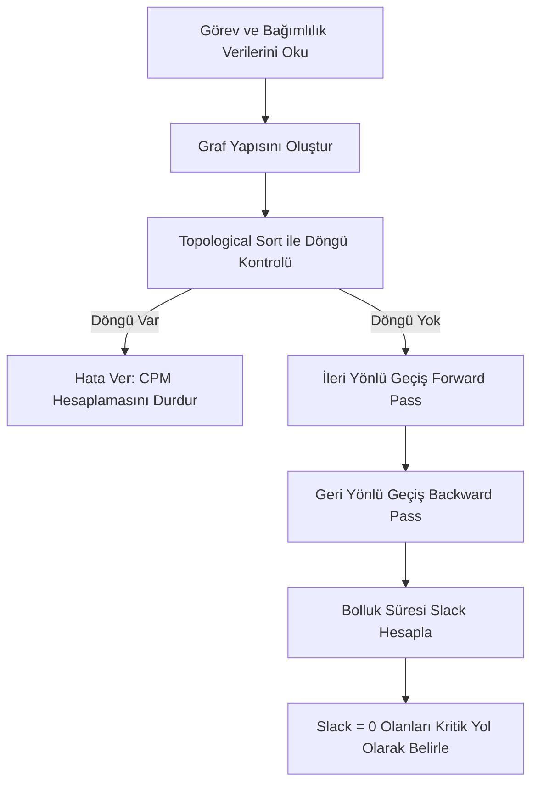

# 📊 FitERP — Proje Yönetimi, Planlama ve CPM Kılavuzu

FitERP, işletmelerin yazılım geliştirme veya operasyonel süreçlerini planlamaları için **Gantt Şeması** ve **Kritik Yol Yöntemi (CPM - Critical Path Method)** algoritmalarını barındıran gelişmiş bir proje yönetimi modülüne (`ProjectManagement.jsx`) sahiptir.

---

## 1. Veri Modeli (Veritabanı Yapısı)

Proje Yönetimi modülü, MySQL üzerinde 3 adet ilişkili tablo kullanarak çalışır. Bu tablolar backend sunucusu ilk ayağa kalktığında otomatik olarak oluşturulur (`initializePMTables` fonksiyonu):

### A. Ekip Tablosu (`pm_team`)
Projede görev alacak çalışanları tanımlar.
*   `id` (INT, Primary Key, Auto Increment)
*   `full_name` (VARCHAR) - Ad Soyad
*   `role` (VARCHAR) - Rol/Pozisyon (Örn: Proje Yöneticisi, Yazılım Geliştirici)
*   `email` (VARCHAR) - E-posta

### B. Görev Tablosu (`pm_tasks`)
İş paketlerini, sürelerini ve öncül ilişkilerini tutar.
*   `id` (INT, Primary Key, Auto Increment)
*   `name` (VARCHAR) - Görev Adı
*   `description` (TEXT) - Açıklama
*   `start_date` (DATE) - Görevin takvim üzerindeki başlangıç tarihi
*   `duration_days` (INT, Default 1) - Görevin tamamlanma süresi (Gün)
*   `progress` (INT, Default 0) - İlerleme yüzdesi (%0 - %100)
*   `assignee_id` (INT, Foreign Key -> `pm_team.id`) - Görevin atandığı çalışan
*   `dependencies` (VARCHAR) - Öncül görevlerin ID listesi (Virgülle ayrılmış dize, örn: `"1,2"`)

### C. Proje Bütçesi Tablosu (`pm_budget`)
Projeye ait gelir ve gider hareketlerini tutar.
*   `id` (INT, Primary Key, Auto Increment)
*   `type` (ENUM: `'income'`, `'expense'`) - Gelir veya Gider
*   `category` (VARCHAR) - Kategori (Örn: Altyapı, Danışmanlık, Lisans)
*   `amount` (DECIMAL(10,2)) - Tutar
*   `date` (DATE) - İşlem Tarihi
*   `description` (TEXT) - Açıklama

---

## 2. CPM (Kritik Yol Yöntemi) Algoritması

CPM, projenin toplam tamamlanma süresini ve hangi görevlerin **hiçbir şekilde gecikmemesi gerektiğini (kritik görevler)** hesaplayan matematiksel bir ağ analiz yöntemidir. Algoritma adımları `ProjectManagement.jsx` içinde `calculateCPM` fonksiyonunda işletilir:

### Adım 1: Döngüsel Bağımlılık Kontrolü (Topological Sort)
Görevlerin birbirine kısır döngü oluşturacak şekilde bağlanıp bağlanmadığı kontrol edilir.
*   **Örnek Döngü:** A görevi B'ye bağımlı, B görevi C'ye bağımlı, C görevi ise A'ya bağımlı.
*   Derinlik Öncelikli Arama (DFS) algoritması ile çalışan Topological Sort kullanılarak döngü tespit edilirse, CPM durdurulur ve şu hata basılır:
    > "Döngüsel Bağımlılık Tespit Edildi! Görevlerin öncülleri birbirini kısır döngüye sokuyor."

### Adım 2: İleri Yönlü Geçiş (Forward Pass)
Her görevin en erken başlayabileceği gün (**Early Start - ES**) ve en erken bitebileceği gün (**Early Finish - EF**) hesaplanır.
*   Öncülü olmayan görevler için:
    $$ES = 0$$
*   Öncülü olan görevler için:
    $$ES = \max(EF_{\text{öncüller}})$$
*   En erken bitiş değeri:
    $$EF = ES + \text{Süre (duration\_days)}$$
*   *Tüm görevlerin EF değerlerinin en büyüğü, projenin toplam süresini belirler.*

### Adım 3: Geri Yönlü Geçiş (Backward Pass)
Her görevin projenin toplam süresini uzatmadan en geç başlayabileceği (**Late Start - LS**) ve en geç bitebileceği (**Late Finish - LF**) gün hesaplanır.
*   Ardılı (successor) olmayan görevler için:
    $$LF = \text{Proje Toplam Süresi}$$
*   Ardılı olan görevler için:
    $$LF = \min(LS_{\text{ardıllar}})$$
*   En geç başlangıç değeri:
    $$LS = LF - \text{Süre}$$

### Adım 4: Bolluk (Slack) Hesabı ve Kritik Yol
Her görevin bolluk süresi (slack/float) hesaplanır:
$$Slack = LF - EF \quad \text{veya} \quad Slack = LS - ES$$
*   **Bolluk Süresi (Slack) = 0** olan görevler **Kritik Görev** olarak tanımlanır. Bu görevlerin herhangi birinde yaşanacak 1 günlük gecikme, projenin tamamlanma süresini doğrudan 1 gün uzatır.

---

## 3. Görselleştirme Araçları

### 📈 Gantt Şeması
CPM hesaplamalarından elde edilen `ES` ve `EF` sürelerine göre dinamik olarak çizilir:
*   Yatay barlar görevlerin takvim üzerindeki konumlarını gösterir.
*   Kritik yolda bulunan (Slack = 0) görevlerin Gantt barları, **kırmızı renkte parlayacak şekilde yanıp sönen (`pulseRed`) premium bir animasyonla** vurgulanır. Bu sayede proje yöneticileri risk altındaki işleri anında görebilir.

### 👥 Kişiye Göre İş Yükü Dağılımı
Ekip üyelerinin aynı anda kaç göreve atandığını ve projedeki yoğunluk durumlarını zaman çizelgesi üzerinde gösterir. Bu sayede aşırı yüklenmiş veya boşta kalmış kaynaklar hızlıca tespit edilebilir.

### 💰 Bütçe & Sermaye Yönetimi
Projenin finansal sağlığını korumak için tasarlanmış KPI kartları:
*   **Toplam Gelir:** Projeye sağlanan fonlar.
*   **Toplam Gider:** Altyapı, lisans veya maaş harcamaları.
*   **Net Sermaye:** Gelir - Gider dengesi.
*   **Bütçe Kullanım Yüzdesi:** Harcamaların toplam gelire olan yüzdesel oranı.

---

## 4. Raporlar Modülü
Proje analizi bittikten sonra "Raporlar" sekmesi üzerinden projenin tamamlanma durumu, kritik görevler listesi, bütçe aşım riskleri ve kaynak dağılımı otomatik olarak özet bir PDF veya yazdırılabilir rapor biçiminde sunulabilmektedir.
