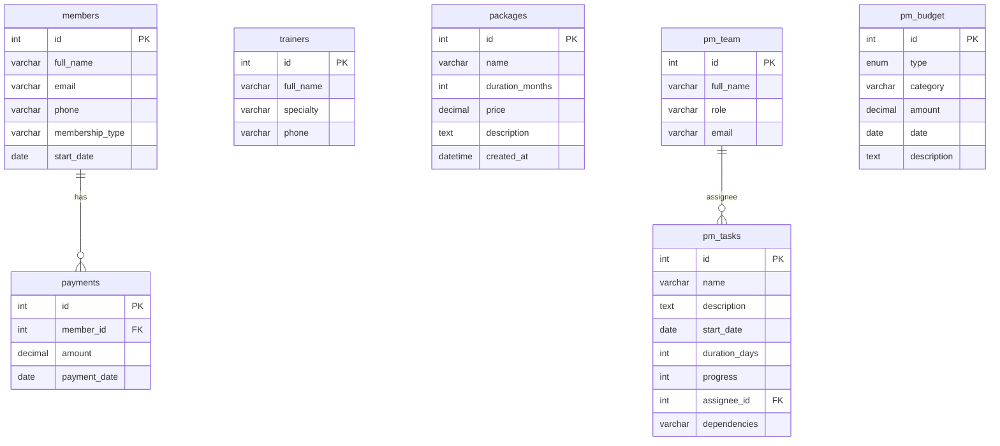
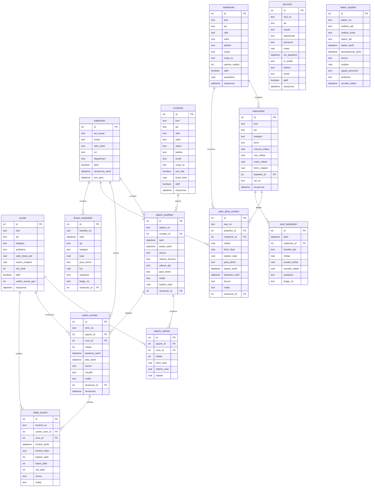

# 🗄️ FitERP & AgroERP — Veritabanı Yönetim Panelleri Kılavuzu

Uygulamada iki farklı veritabanı yönetim katmanı yer almaktadır:
1. **FitERP Canlı MySQL Arayüzü:** React frontend üzerinden backend sunucusuna bağlanarak canlı MySQL veritabanını (`fiterp_db`) yöneten ekran (`DatabaseManager.jsx`).
2. **AgroERP SQLite Simülatörü:** WebAssembly tabanlı SQLite (`sql.js`) kullanarak tarım odaklı bir ERP sistemini tarayıcı belleğinde tamamen bağımsız simüle eden HTML5 uygulaması (`2026 AgroERP_DB_Yoneticisi.html`).

---

## 1. Veritabanı Mimarileri ve ER Şemaları

### A. FitERP MySQL Arayüzü Şeması
Bu şema spor salonu üyelik sistemini ve entegre proje yönetim araçlarını temsil eder. Canlı MySQL üzerinde koşar.



---

### B. Standalone AgroERP Şeması (SQLite Simülatörü)
Bu modül, kapsamlı bir tarım/üretim odaklı ERP şemasını simüle eder ve `2026 AgroERP_DB_Yoneticisi.html` üzerinde SQLite in-memory olarak çalışır. 14 adet ilişkisel tablodan oluşur:



---

## 2. Arayüz Yetenekleri ve SQL Editörü

### 🏗️ A. Şema Görünümü (Schema Viewer)
Her iki arayüzde de sol tarafta veritabanındaki tabloların listesi yer alır. Tabloların üzerine tıklandığında:
*   Tablodaki tüm sütunların isimleri, veri tipleri (INTEGER, VARCHAR, TEXT, REAL vb.), Primary Key (PK), Foreign Key (FK) ve Nullable/Not Null (NN) kısıtlamaları görselleştirilir.
*   Her tablonun yanındaki satır sayıları ve disk boyutları canlı olarak `information_schema` veya in-memory SQLite sayaçlarından çekilerek gösterilir.

### ⌨️ B. SQL Editörü (Premium Code Console)
*   **Renklendirilmiş & Numaralandırılmış Satırlar:** Cascadia Code / JetBrains Mono fontlarıyla zenginleştirilmiş koyu mod kod editörü.
*   **Tab Desteği:** Editör içinde `Tab` tuşuna basıldığında form kontrolünü kaybetmeden 2 karakterlik boşluk bırakır.
*   **F5 Kısayolu:** SQL sorgularını hızlı çalıştırmak için F5 klavye kısayolu entegre edilmiştir.
*   **Büyük Harf Formatlayıcı:** `SELECT`, `FROM`, `WHERE`, `JOIN` gibi SQL anahtar kelimelerini otomatik olarak büyük harfe dönüştürür.

> [!IMPORTANT]
> **Veri Güvenliği Kontrolleri (Güvenlik Kalkanı):**
> Kullanıcının yanlışlıkla tüm tabloyu silmesini veya güncellemesini önlemek adına; WHERE koşulu içermeyen `DELETE` ve `UPDATE` komutları ile `DROP` veya `TRUNCATE` ifadeleri çalıştırılmak istendiğinde tarayıcı üzerinden ek bir onay penceresi (`window.confirm`) gösterilmektedir.
> Backend API'lerinde `DROP DATABASE` ve `DROP SCHEMA` komutları doğrudan bloke edilmektedir.

---

## 3. Hazır Şablon Sorgular ve Raporlar

Panellerde sık kullanılan bazı karmaşık SQL sorguları gömülü olarak gelir:

### 📈 Üye Başına Toplam Ödeme (FitERP)
Her üyenin yaptığı ödeme miktarları ve toplam harcaması:
```sql
SELECT m.id, m.full_name AS Uye, m.membership_type AS Paket, 
       COUNT(p.id) AS Odeme_Sayisi, IFNULL(SUM(p.amount), 0) AS Toplam_Odeme
FROM members m
LEFT JOIN payments p ON m.id = p.member_id
GROUP BY m.id, m.full_name, m.membership_type
ORDER BY Toplam_Odeme DESC;
```

### 🔩 Kritik Stok Uyarısı (AgroERP)
Minimum stok seviyesinin altına düşen hammaddeler ve bunları sağlayan tedarikçiler:
```sql
SELECT m.kod, m.ad, m.mevcut_miktar, m.min_miktar, 
       (m.min_miktar - m.mevcut_miktar) AS acik_miktar, t.ad AS tedarikci
FROM malzemeler m
LEFT JOIN tedarikciler t ON m.tedarikci_id = t.id
WHERE m.mevcut_miktar <= m.min_miktar
ORDER BY acik_miktar DESC;
```

### 🏭 Ürün Karlılık Analizi (AgroERP)
Satış fiyatı ile üretim maliyetini kıyaslayıp kar marjını yüzdesel olarak hesaplayan sorgu:
```sql
SELECT kod, ad, satis_fiyati_usd, uretim_maliyeti,
       (satis_fiyati_usd - uretim_maliyeti) AS kar_usd,
       ROUND((satis_fiyati_usd - uretim_maliyeti) * 100.0 / satis_fiyati_usd, 1) AS kar_marji_pct
FROM urunler
WHERE aktif = 1
ORDER BY kar_marji_pct DESC;
```

---

## 4. Dışa Aktarma (Export) Seçenekleri

Sorgu sonuçları veya tablo tarayıcısındaki veriler tek tıkla dışa aktarılabilir:
*   **CSV Dışa Aktar:** Çıktıyı UTF-8 BOM standardına uygun, Excel ile tam uyumlu Türkçe karakter destekli virgülle ayrılmış CSV formatında indirir.
*   **JSON Dışa Aktar:** Veriyi ham, biçimlendirilmiş bir JSON dizisi olarak kaydeder.
*   **SQL Dışa Aktar (SQLite Simülatöründe):** Mevcut veritabanının yapısını ve in-memory verilerini içeren SQL script dosyasını indirir.
